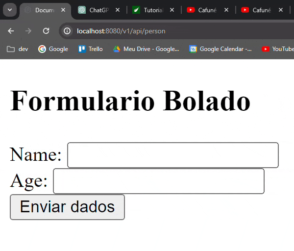

<h1 align="center">
    <span>Recebendo informacoes de um formulario</span>
    
</h1>

Sempre que vamos preencher um formulario nós estamos basicamente enviando dados para uma rota POST.

O fluxo de um preenchimento de formulario é igualzinho o fluxo de uma API REST.

- O usuario vai fazer uma solicitacao/request para uma rota **POST**
- Ele informa no body da requisicao (@RequestBody) um objeto JSON que ele deseja enviar.

<br>


## Entendendo como funciona um formulario

Sempre que estiver mexendo com um formulario, lembre-se que voce esta, nada mais nada menos, que fazendo um request para uma rota POST. Igualzinho fazíamos com REST APIs.


```html
<form action="/v1/api/person" method="post"> <!-- Informamos qual a action/rota do tipo POST que vamos fazer o reqeust -->
    <div>
        <label for="campo1">Name: </label>
        <input id="campo1" type="text" name="name"> <!-- Informamos o 'name' do attribute JSON que vai ser enviado -->
    </div>
    <div>
        <label for="campo2">Age: </label>
        <input id="campo2" type="number" name="age">
    </div>
    <button type="submit">Enviar dados</button> <!-- Estamos fazendo o request de fato-->
</form>
```

<br>

## Praticando



<br>

Quando estamos falando de prencher um formulário, o que acontece é o seguinte:

- O usuario acessa uma rota GET para preencher o formulario.
- Ao clicar em submit, o usuario faz uma requisicao do tipo POST e envia um objeto JSON no body da requisicao. Igualzinho quando fazemos com REST APIs.
- A rota Post recebe esse JSON e retorna uma view contendo esse cara.

<br>

✏️ Como visto na GIF, o objetivo é voce enviar um objeto JSON, atraves de um formulario, e exibir esses dados em uma outra view/template html.

<br>

```html
<body>
    <h2>Formulario Bolado</h2>
    <form action="/v1/api/person" method="post"> <!-- Informamos qual a rota POST que vai receber esses dados inputados. Esse formulario é como se fosse o @RequestBody, sacou? -->
        <div>
            <label for="campo1">Name: </label>
            <input id="campo1" type="text" name="name"> <!-- 'name' é o attribute que vamos usar para setar o nome do attribute do objeto JSON que sera enviado -->
        </div>
        <div>
            <label for="campo2">Age: </label>
            <input id="campo2" type="number" name="age"> <!-- 'name' é o attribute que vamos usar para setar o nome do attribute do objeto JSON que sera enviado -->
        </div>

        <button type="submit">Enviar dados</button> <!-- Ao clicar em 'submit' é feito uma requisicao/solicitacao/request para a rota POST e enviado esses dados atraves do body da requisicao -->
    </form>
</body>
```

<br>
<br>

```java
@GetMapping("/person") //usamos essa rota GET para preencher o formulario
public ModelAndView rotaTeste(){ 
    ModelAndView mv = new ModelAndView("/frontendBolado/formularioBolado.html");
    return mv;
}


@PostMapping("/person") //usamos essa rota POST para receber o objeto JSON enviado no requestbody
public ModelAndView receberDados(@ModelAttribute Person personEnviadaNoBody){ // Igualzinho o @RequestBody -> Vamos receber um objeto JSON no body da requisicao. Como esse objeto Person possui os mesmos attributes do JSON, ele recebe esses attributes. Padraozinho, igual RestAPI.
    ModelAndView mv = new ModelAndView("/frontendBolado/exibirPessoa.html");
    mv.addObject("person", personEnviadaNoBody); //enviamos para a pagina html esses objeto que recebemos atraves do body da requisicao
    return mv;
}
```
<br>

📖 Sempre que estiver trabalhando com forms, pense em uma API REST. O fluxo de informacoes é igualzinho. O usuario vai enviar um objeto JSON no body da requisicao. O method correspondente a esse rota POST vai fazer alguma coisa com esse objeto JSON recebido.

<br>

Easy! 😎 Agora, vamos aprender a validar esses inputs de formulario.