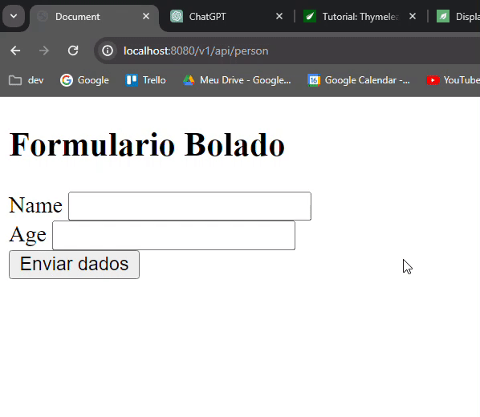

<h1 align="center">
    <span>Validando o input do usuario</span>
    
</h1>

Sempre que precisamos validar os inputs de um formulario, vamos pensar em `Bean Validation` + ``BindingResult``.


<br>

Para validar os inputs de um formulario usando thymeleaf, vamos seguir os passos:


1. 
    Baixar a dependencie **Bean Validation**.

    ```xml
    <dependency>
        <groupId>org.springframework.boot</groupId>
        <artifactId>spring-boot-starter-validation</artifactId>
        <version>3.2.0</version>
    </dependency>
    ```


<br>
<br>

2. Quando colocamos essa dependencie, 'desbloqueamos' algumas annotations bem bacanas...

    ```java
    @NotBlank(message = "name cannot be null") //nao pode ser null e precisa ter pelo menos i character non space
    @Size(min = 2, max = 10, message = "Between 2 and 10 characters") // min 2 characters e max 10 characters
    private String name;

    @NotNull(message = "age cannot be null") //nao pode ser null
    @Min(value = 18, message = "Must be older or igual to 18 years old") //idade minima 18 anos
    private Integer age;
    ```

<br>
<br>

3. Vamos na Controller e validamos:

    ```java
    //rota GET para exibir o formulario
    @GetMapping("/person")
    public ModelAndView preencherFormulario(){ 
        ModelAndView mv = new ModelAndView("/frontendBolado/formularioBolado.html");
        mv.addObject("personCreateDto", new PersonCreateDto());//precisamos passar como parametro um objeto do tipo "Person". Assim, conseguimos informar um objeto no th:object.
        return mv;
    }


    //rota para receber o objeto JSON enviado no formulario e mostrar uma pagina html com esse objeto
    @PostMapping("/person")
    public ModelAndView recebendoPerson(@Valid @ModelAttribute Person personRecebidaNoBody, BindingResult br){ //Igualzinho em uma API REST. Recebemos o objeto JSON enviado no body da requisicao (@RequestBody).

        //validamos se algum input foi preenchido errado
        if(br.hasErrors()){
            ModelAndView mv = new ModelAndView("/frontendBolado/formularioBolado.html"); //vamos exibir a view do formulario novamente
            return mv; //automaticamente essa view vai receber informacoes dos erros de input, atraves desse bindingResult
        }

        ModelAndView mv = new ModelAndView("/frontendBolado/exibirPessoa.html");
        mv.addObject("person1", personRecebidaNoBody); //adicionamos esse JSON para nossa pagina
        return mv;  //retornamos uma outra view para exibir as informacoes da Person cadastrada
    }
    ```

<br>
<br>

4. Atualizamos nosso formulario HTML

    ```html
    <body>
        <h2>Formulario Bolado</h2>
        <!-- action -> ao clicar em submit, essa eh a rota/action que vai ser feito o request -->
        <!-- th:object -> Informamos o objeto/variable java que enviamos lá na rota GET -->
        <form method="post" action="/v1/api/person" th:object="${person1}"> <!--  Informamos o objeto que queremos enviar. -->
            <!-- name input -->
            <div>
                <label for="name_input">Name</label>
                <input id="name_input" type="text" name="name" th:field="*{name}"> <!-- Informamos o attribute/field do objeto "Person" que esse input esta relacionado -->
                <!-- Se tiver erro de input, esse elemnto sera exibido -->
                <div th:if="${#fields.hasErrors('name')}" th:errors="*{name}">...</div>
            </div>
            <!-- age input -->
            <div>
                <label for="age_input">Age</label>
                <input id="age_input" type="text" name="age" th:field="*{age}"> <!-- Informamos o attribute/field do objeto "Person" que esse input esta relacionado -->                
                <!-- Se tiver erro de input, esse elemnto sera exibido -->
                <div th:if="${#fields.hasErrors('age')}" th:errors="*{age}">...</div>
            </div>
            <button type="submit">Enviar dados</button>
        </form>
    </body>
    ```

<br>

✏️ Dê submit no formulario e veja a mágica:





<br>

Nao se preocupe com o CSS. O objetivo aqui é aprender o core do thymeleaf. Depois estilizamos com o **bootstrap**.

<hr>
<br>


## Redirect para uma outra rota ou retornar uma pagina html


1. Quando retornamos um redirect, estamos redirecionando o usuário para outra página HTML. Se ele inputou tudo bonitin/certin, ele vai para outra url. Quando um usuário acerta o login, ele é redirecionado para outra página, sacou??

2. Quando retornamos uma página HTMl, estamos permanecendo na mesma página, mantendo os dados inputados. Quando um usuário erra o login, ele permanece na mesma página, mostrando as mensagens de erro, sacou??

Resumindo:
- O usuario acertou o input?? Retorna um redirect bolado para outra URL/rota/action.
- O usuário errou o input? Retorna a mesma página HTML e mostre a mensagem de erro para ele.
